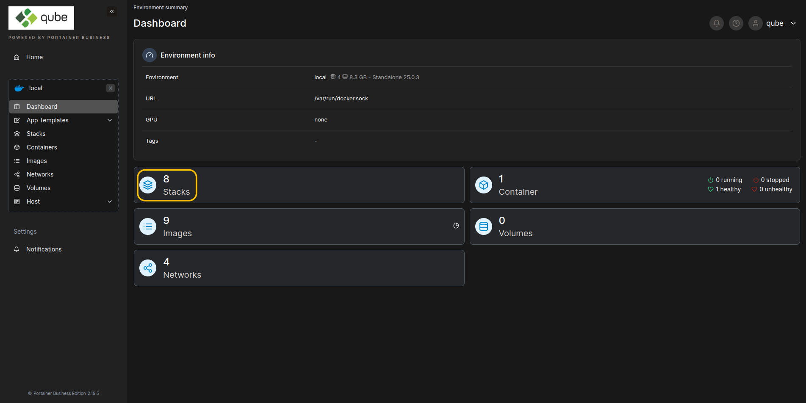

# Connect to your machine

Connect to the machine you want to use by clicking **Live connect**

<figure><figcaption></figcaption></figure>

And you are ready to [start-your-container.md](start-your-container.md "mention")
