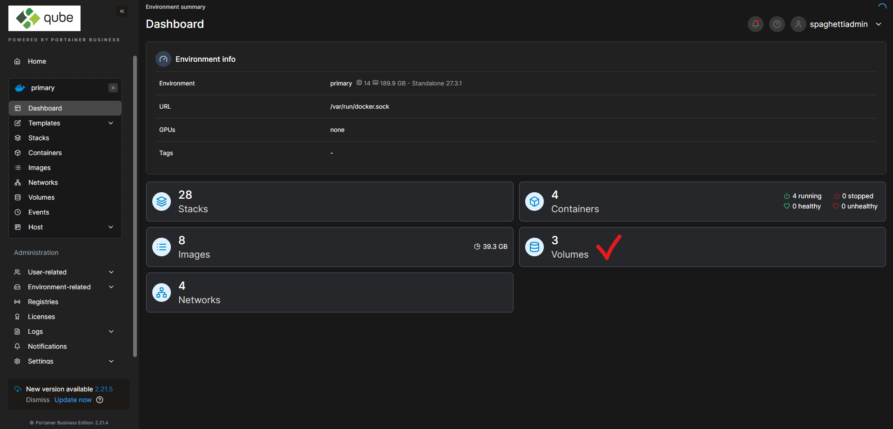

# Running a container with GUI

## Start the container

Let's start a `fiji` container, which has a graphical user interface (GUI)

<figure><figcaption></figcaption></figure>

You start a container by clicking **Start this stack**

<figure><figcaption></figcaption></figure>

## Open the container link

**Open the container** created after starting the stack

<figure><figcaption></figcaption></figure>

Scroll down to the **Container details**, you will need the following details:

* `CONTAINER_URL` - copy and paste the link in a new page
* `CUSTOM_USER` - username to login in the new page
* `PASSWORD` - password to login in the new page

<figure><figcaption></figcaption></figure>

After you open the `CONTAINER_URL` in a new page, login with the credentials above

<figure><figcaption></figcaption></figure>

And the container is ready-to-go!

<figure><figcaption></figcaption></figure>

## Access your data

You can [use-the-filebrowser-container.md](../transfer-data/use-the-filebrowser-container.md "mention") to load data inside the container.&#x20;

Data will be accessible at `/config/researcher_home`

**IMPORTANT -** only files inside the `researcher_home` directory will be stored. The rest is deleted once you stop the container.
